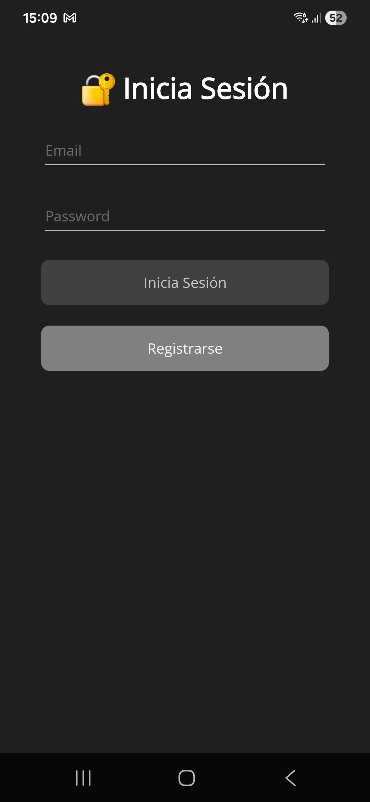
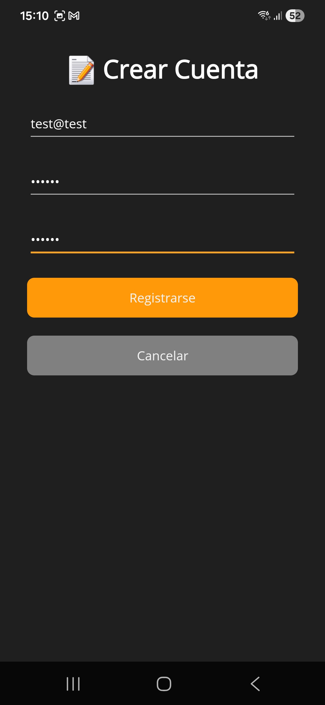

# Password Manager .NET 10

# 📖 Manual de Usuario - Password Manager

## Introducción

Bienvenido a **Password Manager**, tu aplicación segura para guardar y gestionar contraseñas con encriptación avanzada y autenticación biométrica.

---

## 1️⃣ Registro e Inicio de Sesión

### Crear una Cuenta

1. Abre la aplicación y haz clic en "Registrarse"
2. Completa: Email, Contraseña, Confirmar Contraseña
3. Haz clic en "Registrarse"
4. Tu email se cargará automáticamente en LoginPage

<div style="display: flex; gap: 1rem; justify-content: center; flex-wrap: wrap;">
  
  
</div>

### Iniciar Sesión

1. Ingresa tu email registrado
2. Ingresa tu contraseña
3. Haz clic en "Inicia Sesión"
4. Si tienes biometría, puedes usar la huella

**[Ver imagen: doc03.jpg]**

---

## 2️⃣ Configurar Contraseña de Encriptación (VITAL)

⚠️ **IMPORTANTE: Este es el primer paso que DEBES hacer**

1. Ve a Password Details
2. Abre el menú (icono hamburguesa)
3. Selecciona "Nueva clave encriptación"
4. Ingresa y confirma tu contraseña (mínimo 6 caracteres)
5. Haz clic en "Aceptar"

**❌ Sin esta contraseña, NO podrás acceder a tus secretos**
**❌ No la olvides, es tu clave maestra**

**[Ver imágenes: doc04.jpg, doc05.jpg, doc06.jpg]**

---

## 3️⃣ Agregar una Nueva Contraseña (Secreto)

1. En Password Details, haz clic en el botón azul (+)
2. Completa:
   - Nombre/Título (ej: Google, Gmail)
   - Usuario/Email
   - Contraseña
   - Contraseña de Encriptación
3. Puedes usar "Generar" para crear una segura
4. Haz clic en "Guardar"

**[Ver imágenes: doc04.jpg, doc07.jpg, doc08.jpg]**

---

## 4️⃣ Ver y Gestionar Secretos

1. **Descargar secretos** - Desde el menú, selecciona "Descargar contraseñas"
2. **Desencriptar secretos** - Selecciona "Desencriptar todas"
3. **Buscar secretos** - Usa la barra de búsqueda, los resultados se filtran en tiempo real
4. **Ver detalles** - Haz clic en cualquier secreto
5. **Ver contraseña** - Haz clic en el ojo (Ver) e ingresa tu clave
6. **Editar** - Abre el secreto y haz clic en "Editar"
7. **Eliminar** - Abre el secreto y haz clic en "Eliminar"

**[Ver imágenes: doc05.jpg, doc09.jpg, doc10.jpg, doc11.jpg, doc12.jpg, doc13.jpg, doc14.jpg]**

---

## 5️⃣ Usar Biometría (Huella Dactilar)

### Habilitar Biometría

1. Ve a Settings
2. Busca "BIOMETRÍA"
3. Activa el toggle "Huella dactilar"
4. Esta opción solo recordará tu nombre de usuario, por razones de seguridad, tu contraseña no se guarda, por lo que deberás ingresarla manualmente.

**[Ver imagen: doc15.jpg]**

---

## 6️⃣ Configurar Tema

En Settings, busca "TEMA" y selecciona:

1. 🔄 **Auto:** Se ajusta al tema del dispositivo
2. ☀️ **Light:** Modo claro
3. 🌙 **Dark:** Modo oscuro

**[Ver imagen: doc15.jpg]**

---

## 7️⃣ Cerrar Sesión

1. Haz clic en "Logout" (arriba a la derecha)
2. Confirma que deseas cerrar sesión
3. Volverás a LoginPage

**[Ver imagen: doc04.jpg]**

---

## 🔒 Consejos de Seguridad

### ✅ HACER:
- Usar contraseña fuerte (mínimo 8 caracteres)
- Usar números, mayúsculas y símbolos
- Activar biometría
- Cambiar contraseña regularmente
- Usar diferentes contraseñas por cuenta

### ❌ NO HACER:
- Compartir tu contraseña de encriptación
- Usar la misma contraseña en múltiples cuentas
- Guardar contraseña en lugar visible
- Olvidar tu contraseña de encriptación
- Usar passwords débiles

---

## ❓ Preguntas Frecuentes

**P: ¿Qué pasa si olvido mi contraseña de encriptación?**
R: Pierdes la capacidad de descifrar tus secretos. Se recomienda eliminarlos todos. No podemos descifrar la información, ya que desconocemos la contraseña. En el futuro: (Tendrás que crear una nueva desde el menú)

**P: ¿Dónde se guardan mis secretos?**
R: Encriptados en servidores seguros.

**P: ¿Puedo usar sin biometría?**
R: Sí, ingresa tu contraseña normalmente.

**P: ¿Qué si pierdo mi dispositivo?**
R: Inicia sesión desde otro dispositivo y descarga tus secretos.

---

## ¡Gracias por usar Password Manager! 🔐

---

# Password Manager .NET 10

### Dependency
- CommunityToolkit.Maui 13.0.0
- CommunityToolkit.Mvvm 8.4.0
- Microsoft.Extensions.Logging.Debug 10.0.1
- Microsoft.Maui.Controls 10.0.1
- Microsoft.NET.ILLink.Tasks 10.0.1
- Plugin.Maui.Biometric 0.1.0

### Structure
```
PasswordManager_.NET10/
│
├── 📁 Behaviors/
│   └── PasswordDetails/
│       └── MenuAnimationBehavior.cs
│
├── 📁 Converters/
│   ├── InvertedBoolConverter.cs
│   └── StringNotEmptyToBoolConverter.cs
│
├── 📁 DTOs/
│   ├── Request/
│   │   ├── CoreDataDeleteRequest.cs
│   │   ├── CoreDataRequest.cs
│   │   ├── CoreUserIVRequest.cs
│   │   ├── CoreUserRequest.cs
│   │   └── LoginRequest.cs
│   └── Response/
│       └── LoginResponse.cs
│
├── 📁 Exceptions/
│   └── ApiException.cs
│
├── 📁 Helpers/
│   ├── Constants.cs
│   └── Constants_demo.cs
│
├── 📁 Models/
│   ├── ApiResponse.cs
│   ├── CoreSecretData.cs
│   ├── CoreUserIV.cs
│   ├── SessionData.cs
│   └── User.cs
│
├── 📁 Services/
│   ├── Implementation/
│   │   ├── ApiService.cs
│   │   ├── AuthService.cs
│   │   ├── CoreDataService.cs
│   │   ├── EncryptionService.cs
│   │   ├── SecureStorageService.cs
│   │   └── ThemeService.cs
│   │
│   └── Interfaces/
│       ├── IApiService.cs
│       ├── IAuthService.cs
│       ├── ICoreDataService.cs
│       ├── IEncryptionService.cs
│       ├── ISecureStorageService.cs
│       └── IThemeService.cs
│
├── 📁 ViewModels/
│   ├── BaseViewModel.cs
│   ├── LoginViewModel.cs
│   ├── PasswordDetailsViewModel.cs
│   ├── PasswordFormViewModel.cs
│   ├── SettingsViewModel.cs
│   └── TestingViewModel.cs
│
├── 📁 Views/
│   ├── Authentication/
│   │   └── LoginPage.xaml(.cs)
│   │
│   ├── Components/
│   │   └── TestingPage.xaml(.cs)
│   │
│   └── Main/
│       ├── PasswordDetailsPage.xaml
│       ├── PasswordFormPage.xaml
│       ├── PasswordPromptPage.xaml
│       └── SettingsPage.xaml
│
├── 📁 Extensions/
│   └── #NADA AUN
│
├── App.xaml
├── App.xaml.cs
├── AppShell.xaml
├── AppShell.xaml.cs
├── MauiProgram.cs
│
└── PasswordManager.Maui.csproj
```
