# Password Manager .NET 10

<!-- MANUAL:INICIO - generado por .github/scripts/sync-manual.py, no editar a mano -->

## Manual de Usuario <br> Password Manager

Bienvenido a **Password Manager**. Este manual te explica, paso a paso, cómo usar la aplicación para guardar y gestionar tus contraseñas.

> Esta guía es un documento vivo: se actualiza a medida que la aplicación suma funciones.

---

### Contenido

1. Registro e inicio de sesión
2. Configurar la clave de encriptación
3. Agregar un secreto
4. Ver y gestionar secretos
5. Usar biometría
6. Configurar el tema
7. Cerrar sesión
8. Consejos de seguridad
9. Preguntas frecuentes

---

### 1. Registro e inicio de sesión

Para entrar por primera vez necesitas una cuenta. El registro solo toma un correo y una contraseña.

#### Crear una cuenta

<p align="center" style="background-color: #f0f0f0; padding: 15px;">
  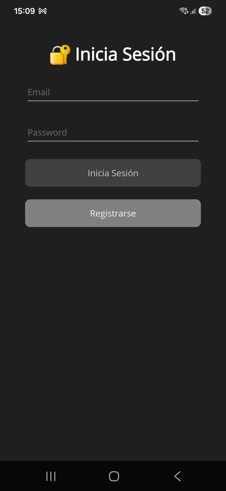
  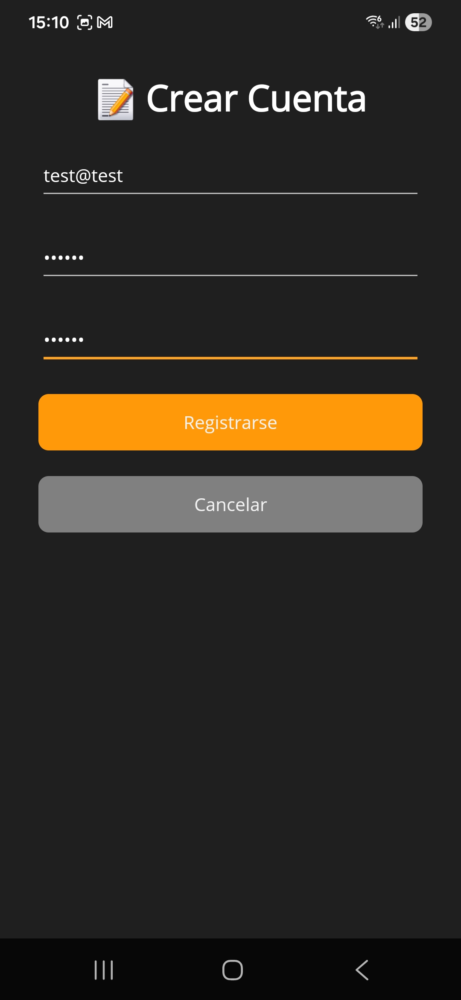
</p>

- Abre la aplicación y haz clic en **Registrarse**.
- Completa tu correo, tu contraseña y la confirmación.
- La contraseña debe tener **mínimo 6 caracteres**. No hay reglas obligatorias de mayúsculas, números o símbolos.
- Al terminar, tu correo se carga solo en la pantalla de inicio de sesión.

#### Iniciar sesión

<p align="center" style="background-color: #f0f0f0; padding: 15px;">
  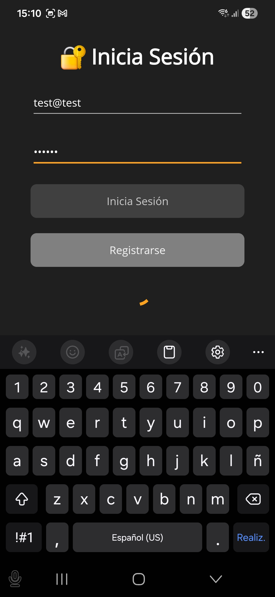
</p>

- Ingresa tu correo registrado.
- Ingresa tu contraseña.
- Haz clic en **Inicia Sesión**.
- Si activaste biometría, también puedes entrar con la huella.

#### Consejos

- El correo no distingue mayúsculas de minúsculas.
- Si tu cuenta quedó bloqueada por intentos fallidos, espera a que expire el bloqueo antes de reintentar.
- Registrarte no te da acceso a los secretos: primero tienes que crear tu clave de encriptación.

---

### 2. Configurar la clave de encriptación (vital)

Tu clave de encriptación es la que cifra y descifra tus secretos. **Sin ella no puedes recuperar nada.**

> [!IMPORTANT]
> Este es el primer paso que DEBES hacer.

<p align="center" style="background-color: #f0f0f0; padding: 15px;">
  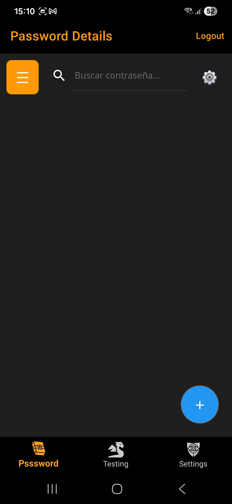
  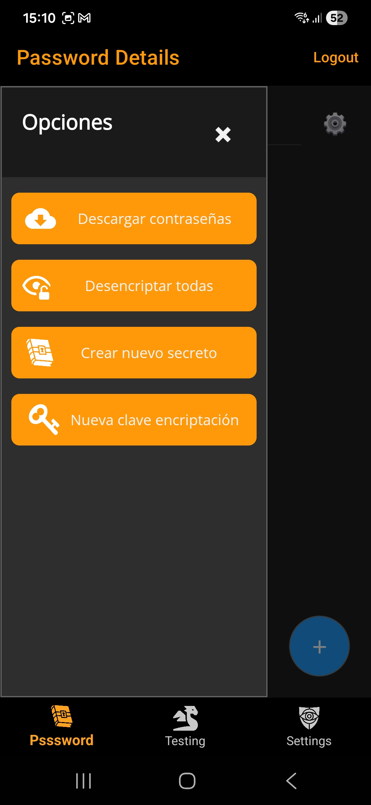
  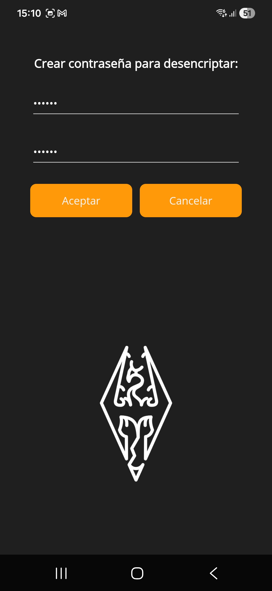
</p>

- Ve a **Password Details**.
- Abre el menú (icono de hamburguesa).
- Selecciona **Clave encriptación**.
- Ingresa y confirma tu clave, con **mínimo 6 caracteres**.
- Haz clic en **Aceptar**.

Una vez creada, la clave no se puede volver a cambiar desde la aplicación.


> [!CAUTION]
> si ya creaste tu clave y vuelves a entrar a **Clave encriptación**, la aplicación
> responde con el error **"Ya tienes una clave de encriptación creada"** y no hay
> forma de reemplazarla desde la app. Trátala como la única que vas a tener.

#### Consejos

- No la confundas con la contraseña de tu cuenta: son dos cosas distintas.
- No existe forma de recuperarla. Si la olvidas, tus secretos quedan ilegibles para siempre.
- No la compartas con nadie y no la guardes junto a tus secretos.

---

### 3. Agregar un secreto

Un secreto es cada contraseña que guardas: un correo, una red social, un banco.

<p align="center" style="background-color: #f0f0f0; padding: 15px;">
  
  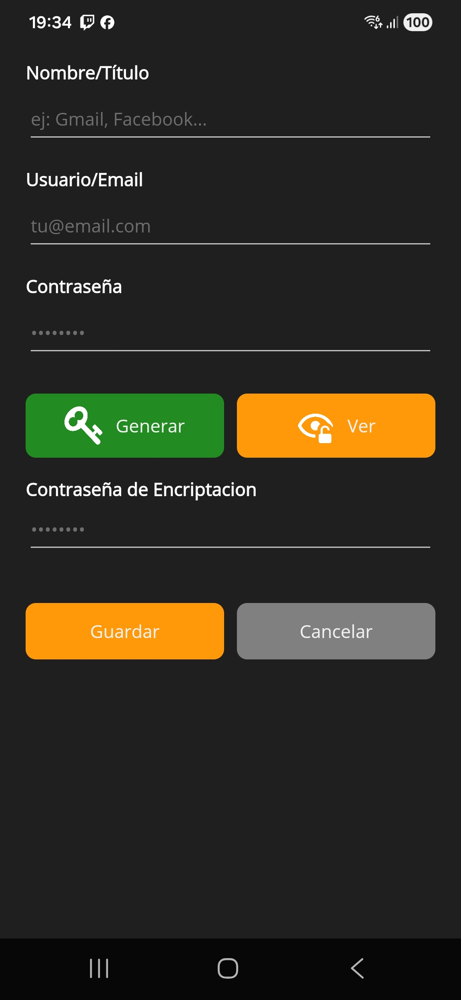
  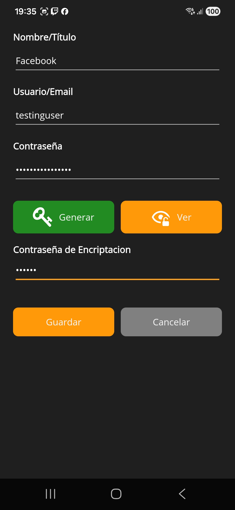
</p>

- En **Password Details**, haz clic en el botón azul (+).
- Completa el nombre o título, el usuario o correo, la contraseña y tu clave de encriptación.
- Puedes usar **Generar** para crear una contraseña segura en lugar de escribirla.
- Haz clic en **Guardar**.

#### Consejos

- Ponle un nombre reconocible: si no, después no vas a saber qué secreto es cuál.
- Usa **Generar** para las cuentas donde puedas cambiar la contraseña después.
- La clave de encriptación que escribes aquí es la del paso 2, no la de tu cuenta.

---

### 4. Ver y gestionar secretos

<p align="center" style="background-color: #f0f0f0; padding: 15px;">
  
  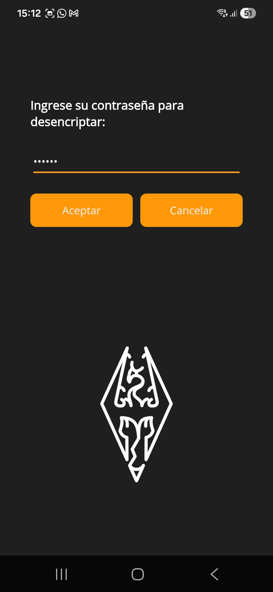
  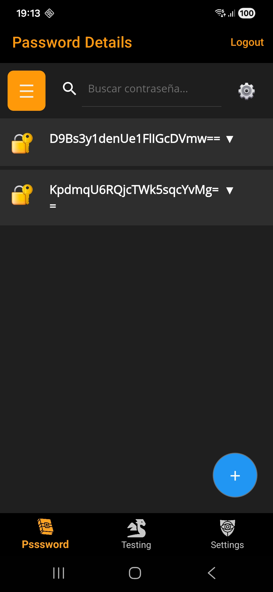
  
  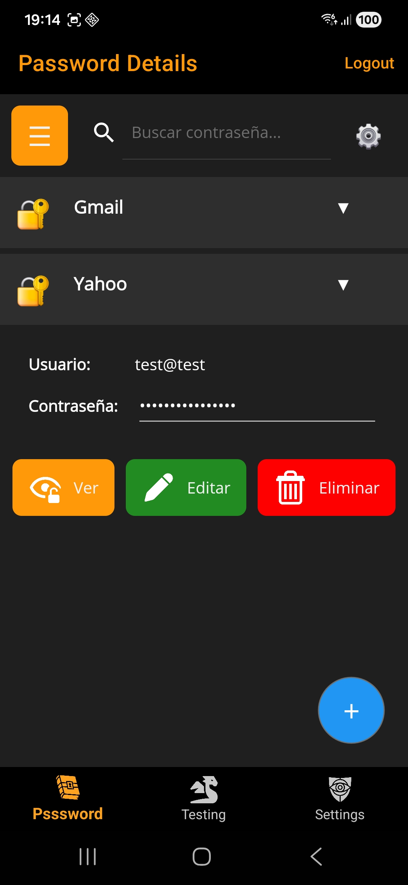
  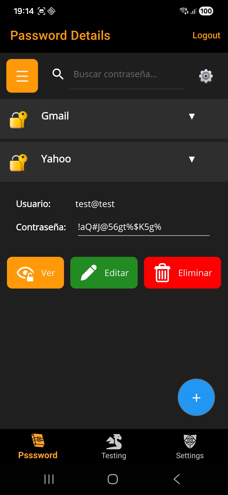
  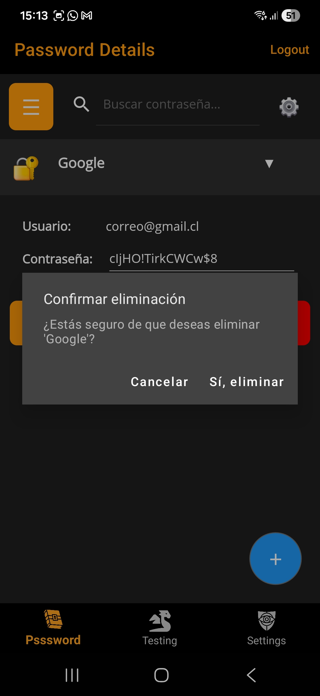
</p>

- **Descargar secretos**: desde el menú, baja todos tus secretos en un archivo.
- **Desencriptar secretos**: descifra todo de una vez para leerlo sin escribir la clave cada vez.
- **Buscar**: usa la barra de búsqueda; los resultados se filtran mientras escribes.
- **Ver detalles**: haz clic en cualquier secreto de la lista.
- **Ver contraseña**: haz clic en el ojo e ingresa tu clave de encriptación.
- **Editar**: abre el secreto y haz clic en **Editar**.
- **Eliminar**: abre el secreto y haz clic en **Eliminar**.

#### Consejos

- Necesitas tu clave de encriptación para leer cada secreto, aunque tengas biometría activada.
- Descarga tus secretos de vez en cuando: así los tienes aunque pierdas el dispositivo.
- Si eliminas un secreto no hay forma de recuperarlo.

---

### 5. Usar biometría

#### Habilitar biometría

<p align="center" style="background-color: #f0f0f0; padding: 15px;">
  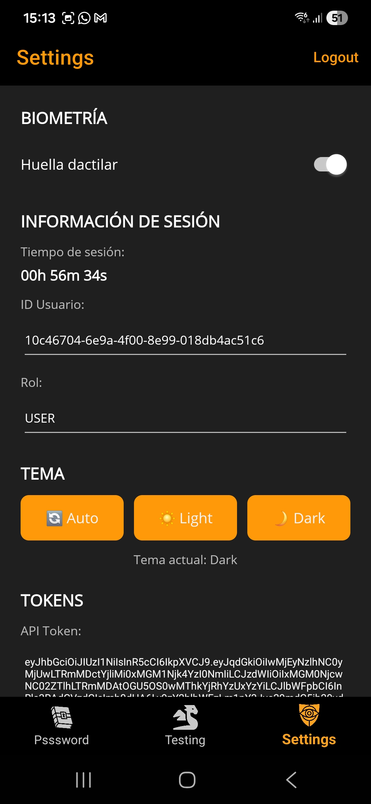
</p>

- Ve a **Settings**.
- Busca la sección **BIOMETRÍA**.
- Activa el toggle **Huella dactilar**.

La biometría solo recuerda tu nombre de usuario. La contraseña **no se guarda de forma automática**: mientras la opción **Guardar contraseña** esté desactivada, tienes que escribirla a mano.

#### Guardar contraseña

- **Guardar contraseña** es una opción aparte, en Settings, y viene desactivada.
- Si la activas, tu contraseña queda almacenada cifrada en el almacenamiento seguro del dispositivo.
- Al desactivar la biometría, esta opción se apaga sola y la contraseña guardada se elimina.

#### Consejos

- La biometría no evita que ingreses la clave de encriptación para leer un secreto.
- Guarda la contraseña solo si aceptas que quede en el dispositivo.

---

### 6. Configurar el tema

<p align="center" style="background-color: #f0f0f0; padding: 15px;">
  
</p>

En **Settings**, busca la sección **TEMA** y selecciona una opción:

- ☀️ **Light**: modo claro.
- 🌙 **Dark**: modo oscuro.

En la misma pantalla, al final, aparece la versión de la aplicación con el formato `v1.0.0 (build 1)`. Si la que ves no coincide, puede que la aplicación no esté actualizada.

---

### 7. Cerrar sesión

<p align="center" style="background-color: #f0f0f0; padding: 15px;">
  
</p>

- Haz clic en **Logout**, arriba a la derecha.
- Confirma que quieres cerrar sesión.
- Vuelves a la pantalla de inicio de sesión.

---

### 8. Consejos de seguridad

#### ✅ HACER

- Usar una contraseña fuerte (la app exige 6 caracteres, pero conviene más larga).
- Agregar números, mayúsculas y símbolos si te ayuda a recordarla.
- Activar la biometría.
- Usar contraseñas diferentes para cada cuenta.
- Cambiar tus contraseñas regularmente.
- Descargar tus secretos de vez en cuando.

#### ❌ NO HACER

- Compartir tu clave de encriptación.
- Usar la misma contraseña en varias cuentas.
- Guardar contraseñas en lugares visibles.
- Olvidar tu clave de encriptación.
- Usar contraseñas débiles.

---

### 9. Preguntas frecuentes

**P: ¿Qué pasa si olvido mi clave de encriptación?**
R: Pierdes la capacidad de descifrar tus secretos, y no hay forma de recuperarlos porque la aplicación no conoce tu clave. Tendrías que crear una nueva desde el menú, pero los secretos que tenías guardados quedarían ilegibles.

**P: ¿Dónde se guardan mis secretos?**
R: Cifrados con tu clave de encriptación antes de enviarse al servidor. El servidor los guarda sin poder descifrarlos.

**P: ¿Puedo usar la app sin biometría?**
R: Sí. Ingresa tu contraseña normalmente.

**P: ¿Qué si pierdo el dispositivo?**
R: Inicia sesión desde otro dispositivo y descarga tus secretos. Necesitas tu clave de encriptación para descifrarlos.

**P: ¿La contraseña de mi cuenta es la misma que mi clave de encriptación?**
R: No. La contraseña de la cuenta solo protege el inicio de sesión; la clave de encriptación es la que cifra tus secretos.

---

¡Gracias por usar Password Manager! 🔐

<!-- MANUAL:FIN -->

---

# Password Manager .NET 10

## 🐳 Docker

> Sección en construcción: los comandos de despliegue y configuración de contenedores (SQL Server, API WebApiCore, etc.) se documentarán aquí.

- Descargar imagen
```sh
docker pull mcr.microsoft.com/mssql/server
```
- Crear contenedor
```sh
docker container create -e "ACCEPT_EULA=Y" -e "MSSQL_SA_PASSWORD=mysecretpassword" -e "MSSQL_PID=Developer" -p 1433:1433 --name SQLServer mcr.microsoft.com/mssql/server
```
- Prepara una Base de Datos de prueba
```sql
SELECT 
	NAME AS LoginName, 
	TYPE_DESC AS AccountType, 
	create_date, 
	modify_date,
	TYPE
FROM sys.server_principals
WHERE TYPE IN ('S', 'U', 'G');
GO

CREATE LOGIN testing WITH PASSWORD = 'testing', CHECK_POLICY = OFF;
GO

CREATE DATABASE db_testing
GO

USE db_testing
GO

CREATE USER testing FOR LOGIN testing;
GO

EXEC sp_addrolemember 'db_owner', 'testing';
GO
```

- Ejecutar el script del esquema
> El esquema completo (tablas y seed) está en el archivo **`SqlServer.sql`** en la raíz del repositorio (`D:\Repo\.NET\PasswordManager_.NET10\SqlServer.sql`). Ejecútalo contra `db_testing` (en SSMS, Management Studio del contenedor o `sqlcmd`).

```sh
# Ejemplo con sqlcmd dentro del contenedor
docker exec -i SQLServer /opt/mssql-tools18/bin/sqlcmd -S localhost -U sa -P "mysecretpassword" -d db_testing -i /dev/stdin < SqlServer.sql
```

---

### Dependency
- CommunityToolkit.Maui 13.0.0
- CommunityToolkit.Mvvm 8.4.0
- Microsoft.Extensions.Logging.Debug 10.0.1
- Microsoft.Maui.Controls 10.0.1
- Microsoft.NET.ILLink.Tasks 10.0.1
- Plugin.Maui.Biometric 0.1.0

### Structure
```
PasswordManager_.NET10/
│
├── 📁 Behaviors/
│   └── PasswordDetails/
│       └── MenuAnimationBehavior.cs
│
├── 📁 Converters/
│   ├── ExpandedToArrowConverter.cs
│   ├── InvertedBoolConverter.cs
│   └── StringNotEmptyToBoolConverter.cs
│
├── 📁 DTOs/
│   ├── Request/
│   │   ├── CoreDataDeleteRequest.cs
│   │   ├── CoreDataRequest.cs
│   │   ├── CoreUserIVRequest.cs
│   │   ├── CoreUserRequest.cs
│   │   ├── LoginRequest.cs
│   │   └── RegisterRequest.cs
│   └── Response/
│       ├── LoginResponse.cs
│       └── RegisterResponse.cs
│
├── 📁 Exceptions/
│   └── ApiException.cs
│
├── 📁 Helpers/
│   ├── Constants.cs
│   └── Constants_demo.cs
│
├── 📁 Messages/
│   └── RegistrationCompletedMessage.cs
│
├── 📁 Models/
│   ├── ApiProblemDetails.cs
│   ├── CoreSecretData.cs
│   ├── CoreUserIV.cs
│   ├── SessionData.cs
│   └── User.cs
│
├── 📁 Platforms/
│   ├── Android/
│   │   ├── MainActivity.cs
│   │   └── MainApplication.cs
│   ├── iOS/
│   │   ├── AppDelegate.cs
│   │   └── Program.cs
│   ├── MacCatalyst/
│   │   ├── AppDelegate.cs
│   │   └── Program.cs
│   └── Windows/
│       ├── App.xaml
│       └── App.xaml.cs
│
├── 📁 Resources/
│   └── Styles/
│       ├── Colors.xaml
│       └── Styles.xaml
│
├── 📁 Services/
│   ├── Implementation/
│   │   ├── ApiService.cs
│   │   ├── AppInfoService.cs
│   │   ├── AuthService.cs
│   │   ├── BiometricService.cs
│   │   ├── CoreDataService.cs
│   │   ├── DialogService.cs
│   │   ├── EncryptionService.cs
│   │   ├── NavigationService.cs
│   │   ├── SecureStorageService.cs
│   │   ├── SessionManager.cs
│   │   └── ThemeService.cs
│   │
│   └── Interfaces/
│       ├── IApiService.cs
│       ├── IAppInfoService.cs
│       ├── IAuthService.cs
│       ├── IBiometricService.cs
│       ├── ICoreDataService.cs
│       ├── IDialogService.cs
│       ├── IEncryptionService.cs
│       ├── INavigationService.cs
│       ├── ISecureStorageService.cs
│       ├── ISessionManager.cs
│       └── IThemeService.cs
│
├── 📁 ViewModels/
│   ├── BaseViewModel.cs
│   ├── GuidePreviewViewModel.cs
│   ├── LoginViewModel.cs
│   ├── PasswordDetailsViewModel.cs
│   ├── PasswordFormViewModel.cs
│   ├── PasswordPromptCreateViewModel.cs
│   ├── RegisterViewModel.cs
│   ├── SettingsViewModel.cs
│   └── TestingViewModel.cs
│
├── 📁 Views/
│   ├── Authentication/
│   │   ├── LoginPage.xaml(.cs)
│   │   └── RegisterPage.xaml(.cs)
│   │
│   ├── Components/
│   │   ├── LoadingPage.xaml(.cs)
│   │   └── TestingPage.xaml(.cs)
│   │
│   └── Main/
│       ├── GuidePreviewPage.xaml(.cs)
│       ├── PasswordDetailsPage.xaml(.cs)
│       ├── PasswordFormPage.xaml(.cs)
│       ├── PasswordPromptCreatePage.xaml(.cs)
│       ├── PasswordPromptPage.xaml(.cs)
│       └── SettingsPage.xaml(.cs)
│
├── App.xaml
├── App.xaml.cs
├── AppShell.xaml
├── AppShell.xaml.cs
├── MauiProgram.cs
│
└── PasswordManager_.NET10.csproj
```

## Compatility
- Dispositivos nuevos (64-bit) → Usan arm64-v8a (más eficiente)
- Dispositivos viejos (32-bit) → Usan armeabi-v7a (compatible)

```xaml
<!--Compatibilidad con otras arquitecturas de android-->
<RuntimeIdentifiers Condition="'$(TargetFramework)' == 'net10.0-android'">android-arm;android-arm64</RuntimeIdentifiers>
<AndroidSupportedAbis Condition="'$(TargetFramework)' == 'net10.0-android'">armeabi-v7a;arm64-v8a</AndroidSupportedAbis>
```